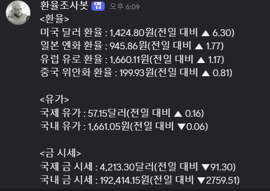

# 1. 자동 환율(엔화) 조사 봇
    - [googlesheet 자동 업데이트](https://docs.google.com/spreadsheets/d/1orK70n0UOnO1IegKy7jejOUBXS0q0K6QP39XYuvg_LM/edit?gid=0#gid=0)
        - [구글 서비스 계정 생성 후, 권한 부여 및 credentials.json 발급](https://cloud.google.com/iam/docs/service-accounts-create?hl=ko)
        - [Google Cloud, Google Sheet API 사용](https://developers.google.com/workspace/sheets/api/reference/rest?hl=ko)

    - Discord Webhook 활용
        

    - [네이버 환율](https://m.stock.naver.com/marketindex/exchange/FX_JPYKRW)